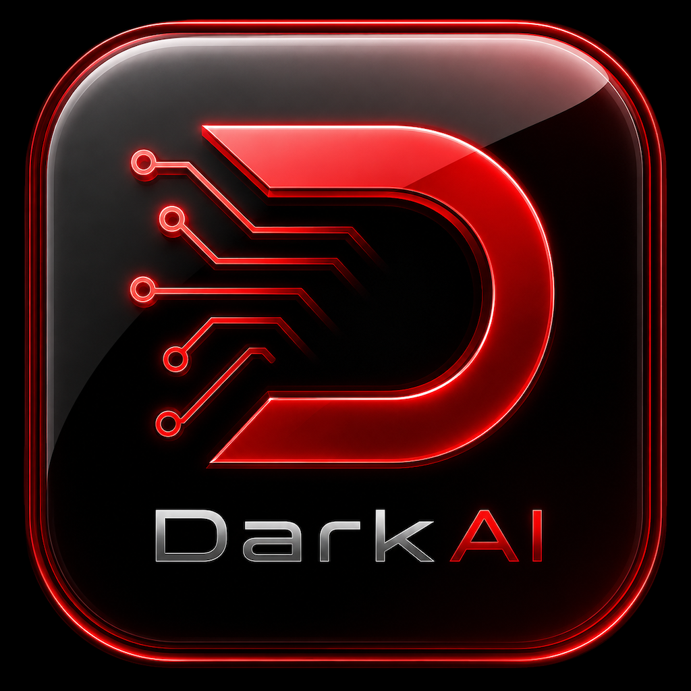

  <!-- App Icon -->
   
  
  # DarkAI

  **Your ultimate, on-device AI companion.**

Welcome to **DarkAI**. This is a fully native iOS application built to run large language models (LLMs) and image generation entirely on your device. No cloud, no subscriptions, just pure AI power sitting right in your pocket.

## ✨ Killer Features

Under the hood, this app is packed with some hella dope capabilities:

* **Local LLM Runner**: Powered by `LLMManager.swift` . It even validates your GGUF model files automatically using `GGUFValidator.swift` .
* **On-Device Image Generation**: Create sick art locally using Stable Diffusion, hooked up via `DiffusionManager.swift`  and `SDWrapper.swift` .
* **Web Search Integration**: AI that can actually browse the web for you, managed by `WebSearchManager.swift`  and `WebSearchProviders.swift` .
* **Chat with Documents (RAG)**: Upload files and let the AI read them using `RAGManager.swift`  and `DocumentProcessor.swift` .
* **Personality Matrix**: Customize exactly how the AI talks and acts with `PersonalityManager.swift` .
* **Long-Term Memory**: It actually remembers what you tell it, carefully managed by `MemoryManager.swift`  and `MemoryBudget.swift` .
* **Built-in Safety**: Keeps things from going off the rails via `SafetyCenter.swift`  and `ImageSafetyAnalyzer.swift` .
* **Rad UI**: Complete with custom themes and a slick `GlitchBackgroundView.swift` .

---

## 🛠️ How to Install (Super Simple Guide)

If you've never built an iOS app before, don't trip! It's actually super easy. Just follow these steps like you're baking a cake:

1. **Download Xcode**: Go to the Mac App Store and download an app called "Xcode". This is the kitchen where we bake Apple apps.
2. **Download this Code**: Click the green "Code" button at the top of this page and select "Download ZIP", then unzip the folder on your Mac.
3. **Open the Project**: Inside that folder, double-click the file named `DarkAI.xcodeproj` . Xcode will open up automatically.
4. **Plug in your iPhone**: Connect your iPhone to your Mac with a cable. 
5. **Select your Phone**: At the very top of the Xcode window, you'll see a little device menu. Click it and select your iPhone from the list.
6. **Hit Play**: Look for the big "Play" button (▶️) in the top left corner of Xcode. Click it! Xcode will build the app and install it right onto your phone. 

*Boom. You're done.* 

---

## 🐛 Found a Bug?

If things get a little glitchy, don't stress. Just let me know what's broken so I can squash it! 

👉 **[Drop a ticket on the Issues Page](../../issues)**

---

  <i>Stay chill and happy coding. ✌️</i>

